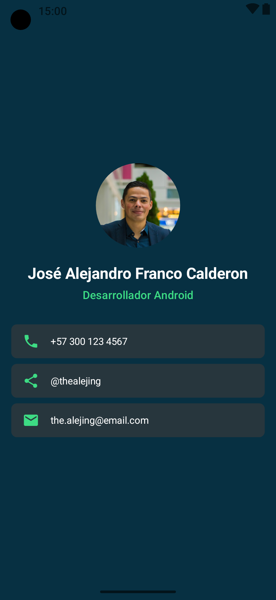
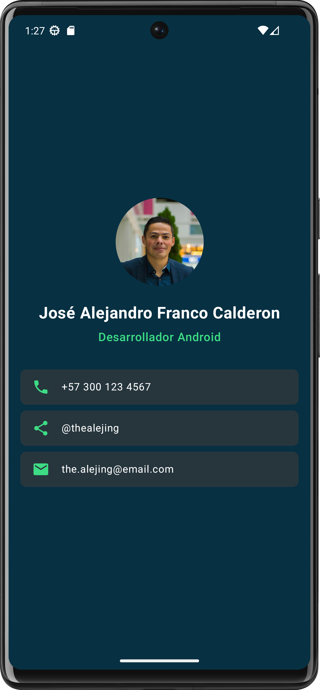

# 💳 Tarjeta de Presentación – Jetpack Compose

Una tarjeta de presentación simple y elegante construida con **Jetpack Compose** y **Material 3**.  
Este proyecto sirve como mini–laboratorio para comprender:
- **Composición de UI sin estado (stateless)** con `@Composable`.
- **Reutilización de componentes** (`ProfileHeader`, `ContactElement`, `ContactInfo`).
- **Manejo de recursos** (`strings.xml`, drawables) y **preview** de componentes.
- **Theming y estilos**: colores, `CircleShape`, `RoundedCornerShape`, `ContentScale`.

> **Ideal para docentes y estudiantes**: es un ejemplo corto, bien estructurado y comentado para introducir los fundamentos de Compose.

---

## 📷 Vistas principales de la app

<p align="center">
  
  
</p>

---

## 🚀 Características principales
- Encabezado de perfil con **imagen circular** y nombre/cargo.
- Sección de **contacto** con íconos: teléfono, redes/enlace y correo.
- Diseño **responsivo y centrado** con `Column`, `Row`, `Spacer` y `Arrangement`.
- **Paleta de color** inspirada en Android/Material (`0xFF073042`, `0xFF3ddc84`).
- **Previews** para cada componente (`@Preview`) que facilitan la iteración en el diseño.

---

## 🧩 Estructura de componentes
- `PresentationCard()`: contenedor principal; compone la pantalla.
- `ProfileHeader()`: avatar circular, nombre y título.
- `ContactInfo()`: lista vertical de métodos de contacto.
- `ContactElement(icon, text)`: fila reutilizable con ícono + texto.

---

## 🧠 Tecnologías utilizadas
- **Kotlin**
- **Jetpack Compose**
- **Material 3 (Icons, Typography)**
- **Android Studio / Gradle**

---

## ⚙️ Requisitos
- Android Studio Ladybug o superior
- Gradle y Kotlin actualizados (según tu instalación)
- **Recursos**:
  - `R.drawable.my_pic` (imagen de perfil)
  - `strings.xml` con `dev_name`, `dev_title`, `dev_phone`, `dev_social`, `dev_mail`, `dev_pic`

Ejemplo mínimo de `strings.xml`:
```xml
<resources>
    <string name="app_name">TarjetaPresentacion</string>
    <string name="dev_pic">Foto del desarrollador</string>
    <string name="dev_name">Tu Nombre</string>
    <string name="dev_title">Desarrollador Android</string>
    <string name="dev_phone">+57 300 000 0000</string>
    <string name="dev_social">linkedin.com/in/tu-perfil</string>
    <string name="dev_mail">tu@email.com</string>
</resources>
```

---

## 🛠️ Cómo ejecutar el proyecto
1. Clona el repositorio:
   ```bash
   git clone https://github.com/alejing/tarjeta-presentacion-app.git
   ```
2. Abre el proyecto en **Android Studio**.
3. Sincroniza Gradle y **ejecuta** en un emulador o dispositivo físico.

---

## 📚 Propósito educativo
- Diferenciar **componentes sin estado** y su ventaja para probar y reutilizar.
- Aplicar **modificadores** (`Modifier.size`, `clip`, `background`, `padding`).
- Usar **íconos** (`Icons.Default.Phone/Email/Share`) y **colores** personalizados.
- Previsualizar componentes aisladamente con `@Preview`.

---

## 🗺️  Roadmap (opcional)
- [ ] Añadir versión con **estado** (ej. mostrar/ocultar secciones).
- [ ] Soporte de **temas claro/oscuro** dinámicos.
- [ ] Animaciones sutiles (e.g., `animateContentSize`).
- [ ] Localización adicional (en/es).

---

## 👨‍🏫 Autor y licencia
Proyecto desarrollado por **José Alejandro Franco Calderon** para fines educativos.  
Licencia: MIT

---
